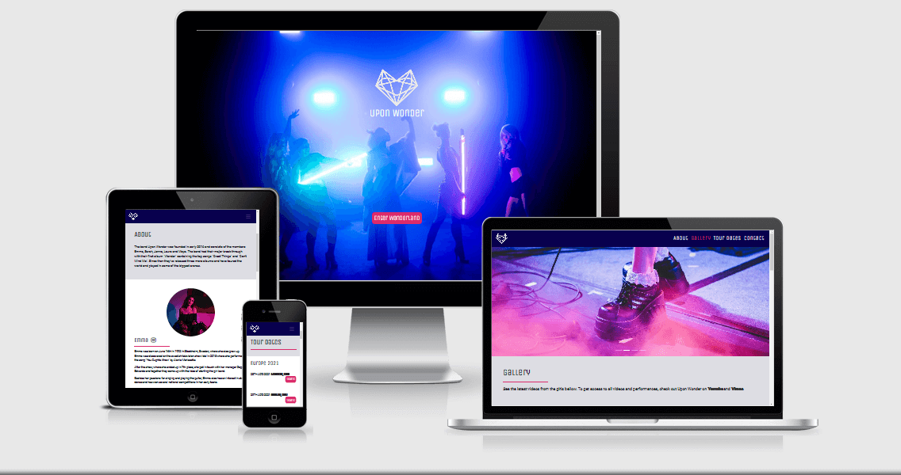

# Upon Wonder - The Band

This is a website to promote the **fictional** band Upon Wonder, including videos, photos, information about each band 
member, tour dates and a contact page to get in touch with the band. The goal for this page is to please both new and
existing fans from all over the world to satisfy their individual need of reaching the information they want when
visiting the page.

My motivation for this web page comes from my own need to quickly and easily find the information I am looking for 
about a band I like. This include a list of uppcoming tour dates and where to find tickets, videos and images of the 
bands latest performances and a contact form through which I can send my complimenting letters of admiration to tell 
the band how big of an impact they've made for me (Even though they might now answear, because they're a band, busy 
doing band stuff).

This is the first Milestone Project in Code Institutes Fullstack Developer Education, and the requirements are to
make a responsive website using HTML and CSS3. This project was also made with Bootstrap which was an option to use
in the project as well.

[View the live project here!](https://josefinekihlstrom.github.io/MS1/)

## UI/UX
The main purpose of the website is to break all information into smaller peaces in to their own pages to make it 
easier for the visitor to find it without getting lost in sections he/she does not want to go to.
The ideal visitor for this web page is not only fans who already know about the band, but also people who are potential
fans and people who want to book the band for a show.

### The business goals for this website are:
* Build awareness about the band to new visitor/potential fans.
* Drive ticket and merchandise sales.
* Increase the number of views on the band's Youtube and Vimeo channels.
* Increase the number of streams on the bands Spotify.
* Increase traffic to the band's shared and personal social media channels.
* Make it easier for companies that want to book the band to get in touch with them.

### UI/UX goals
* Make navigation easy and clear for any visitor with good UX structure.
* Make all information on the page easy to find and understand.
* Customize the web page to be fully responsive to fit all devices.
* Reflect the band's image through good color choices and fonts that accompany to all pages of the website.

### User stories
* As a new visitor I want to get easy access to information about the band, each bandmember and where I can listen
to their music.
* As a visitor I want to get easy access to information about uppcoming tour dates and where I can
buy tickets.
* As a fan of the band I want to be able to buy merchandise or be directed to where I can buy it.
* As a fan I want to get access to view high quality images and videos of the band.
* As a fan I want to be able to send a message to the band.
* As a potential client who wants to book the band I want to be able to send a message with prioritization.
* As a fan/new or returning visitor I want to get an overall good feeling of the bands image throughout the whole
page.

### Design Process
1. Stragety plane: My strategy for this website was to offer a website with clear navigation to the information
the visitor wants to reach. The strategy plane is based on the user stories which made it easier to come up with what
pages I wanted to add to my website.

2. Scope plane: The key features I wanted to add to my website was images of the band members both together and 
separate to get a good picture of who they are, a gallery with photos of the band performing and a clear list with 
tour dates followed by a link to ticket resellers.

3. Structure plane: The scope plane led me to decide which pages I was going to add to my website. I originally 
decided to make my website with four pages: an index page, about page, gallery page and a tour dates page. 

4. Skeleton plane:  My goal for the index page was to make it a little different from the rest of the pages. I knew I 
wanted to activate the visitor in some way, making their visit more of an experience than just showing plain information
straight ahead. I decided that I wanted to cover the index page with a picture of the band, with a simple text on it
and a button that the visitor gets to press to enter the 'website'. The rest of the pages was going to have a footer
at the bottom of the page with social links and a fixed navigationbar at the top with links to the other pages. 
The navigationbar was going to be visible there at all time to make it possible to quickly navigate to another 
page at any time.

5. Surface plane: When all the structure of the site was set I just had to come up with the theme for the website.
    * I started with browsing [Unsplash](https://unsplash.com/) where I searched for potential images of people who looked like they 
    could be in a band, and found [this](https://unsplash.com/photos/MkgeKMXCPnw) picture. After that I could finally decide
    the rest of the theme for the website.
    * To come up with the color scheme for the website I used the generating function of [Coolors](https://coolors.co/).
    The colors I ended up with using to reflect the bands image throughout the entire page was the following:
    #0A014F (The dark blue color used in navbar and footer) and #DB3069 (The bright pink color used on all buttons)
    * The logo was then made with the website [Hatchful](https://hatchful.shopify.com/onboarding/pick-space).
    * The two fonts that were used throughout the whole website was [Unica-One](https://fonts.google.com/specimen/Unica+One?query=unica+one) 
    and [Roboto](https://fonts.google.com/specimen/Roboto?query=roboto).
    
#### Wireframes
- [Index.html Wireframe](assets/wireframe/index-wireframe.png)
- [About.html Wireframe](assets/wireframe/about-wireframe.png)
- [Gallery.html Wireframe](assets/wireframe/gallery-wireframe.png)
- [Tourdates.html Wireframe](assets/wireframe/tourdates-wireframe.png)
- [Mobile Device Wireframe](assets/wireframe/mobiledevice-wireframe.png)

#### Changes I made through the project
When I started to build my website in HTML and CSS I started to notice flaws in my structure. Since this whole 
planning process as a developer is new to me, I realized quite quickly when I started building the website in 
code that the structure I originally made in Wireframes would not last in the end. The lack of continuity of the 
different pages of the website was clear which led me to make changes to my original idea throughout the project. 
The changes included the following:
- Adding a fifth page, the contact page, that was going to include a form to make it possible to contact the band.
- Adding a footer to the index page, to make the access to social links easier without having to go to the next page.
- Move the navbar links to the right to get a better balance to it.
- Adding a hero images to all pages followed by each page heading for a continuous feeling throughout the site.
- Change the image gallery layout to an image slider working as a hero image for the gallery page. For a cleaner look.
- Adding videos to the gallery for some variety in the media content.
- Making the tour dates page more similar in structure as the rest of the pages with the hero image and header text.
- Adding a map to the tour date page.

## Features
The project has a total of five pages. The index page, about page, gallery page, tour dates page and a contact page.
Four out of the five pages features a responsive navigation bar that contains the logo to the left and four options of which
page the visitor wants to go to.

Each page has a footer with social media icons linking to the bands social media pages (As the band is fictional, 
the links only leads to the social media start pages.), and a text of copyright information.

### Index page
The index page contains of an image of the band that covers the whole viewport, the logo, a heading text and a button. 
The purpose of this structure is to activate the viewer to click on the button and evoke a feeling that an 
experience awaits on the other side of the page. When you click the button you will go to the about page.

### About 
The Tour Dates page starts of with an alert section on top of a hero image of the band to inform the visitor about 
the new merchandise that is to be released. The hero image also has a logo on top of it (not visible on phone devices). 
The page includes a heading text with the title of the page, information about the band itself and also 
a presentation of each band member together with an image of them each.

### Gallery 
The hero image section in the gallery acts as an image slider, with four different images from different concerts. The page
includes a heading text with the title of the page and some text under the heading that contain links to the bands
Youtube and Vimeo. Next there is some media content of three [videos](#videos) with a descriptive text about each video.

### Tour Dates 
The Tour Dates page starts of with an alert section on top of a hero image to inform the visitor about the 
cancellation of the 2020 tour. The message also includes a link that will redirect them to Ticketmasters webpage 
with information regarding the cancellation and rescheduling of live events.
Under the hero image the list of tour dates for the year of 2021 is presented. Each performance follows by a pink button
with the text "tickets" that leads the visitor to Ticketmaster where they can purchase tickets to the shows.
Under the tour dates list, there are two columns where the one to the left contains a text that encourages the visitor
to check out the map in the second column to find out where the next show will be.

### Contact
The contact page contains of a hero image followed by a heading text with the title of the page and some information
about how to get in touch with the band. Next follows a form with required input fields, a checkbox and a button 
to send the message. In this case when you press the send message button an alert sign will appear that tells the 
visitor that the bands inbox is currently closed.

### Features Left to Implement
- To make it possible to send a message that actually goes somewhere. 
- To make a page with the bands merchandise that the visitor would be able to purchase. 
- To make it possible for visitors to sign up for a newsletter subscription to get regular newsletters with information about upcoming albums, tours and other
exclusive updates and information from the band.

## Technologies Used
### Languages
- HTML5 - language for the project.
- CSS - for styling the HTML code.

### Libraries
- [Bootstrap](https://getbootstrap.com/) - mainly used for the responsive grid system byt styled accordingly to the theme of the website.
- [FontAwesome](https://fontawesome.com/) - all icons on the website.
- [Google Fonts](https://fonts.google.com/) - used for the "Roboto" and "Unica-One" fonts.
- [Unsplash](https://unsplash.com/) - all images used on the page (credits to the photographers further down).
- [jQuery](https://jquery.com/) - was used for the built-in Javascript to work in Bootstrap.

### Technologies
- [Gitpod](https://www.gitpod.io/)
- [Github](https://github.com/)
- Google Chrome Developer Tool (built in the Google Chrome browser)
- Firefox Developer Tool (built in the Firefox browser)
- [Balsamiq](https://balsamiq.com) - used to make wireframes
- [Coolors](https://coolors.co/) - to generate the color scheme for the page.
- [Hatchful](https://hatchful.shopify.com/onboarding/pick-space) - used to create the logo for the band.
- [Embed Google Maps](https://www.embedgooglemap.net/en/?gclid=CjwKCAjwmMX4BRAAEiwA-zM4JoyJB_AMMTM8hXyyqUkgRPOhXRWv6NyhWXqxULExeMFMwcGrFYMOzRoCLf0QAvD_BwE) - used to embed google map address.
- [Vimeo](https://vimeo.com/) - used to embed videos in gallery.
- [TinyPNG](https://tinypng.com/) - used to compress images.
- [Free Formatter](https://www.freeformatter.com/) - used to format the html code.

## Testing
- [W3C CSS Validation](https://jigsaw.w3.org/css-validator/)
- [W3C Markup Validation](https://validator.w3.org/)

### Manual Testing of the Index page
- Verified that the background image covers the whole viewport.
- Verified that the zoom effect works on logo.
- Verified that the hover effect works on button and that it links to the about page.
- Verified that the hover effects works on the social media icons in the footer and that they link to their 
respective social media pages.

All the above tests where verified in the following browsers:
- Google Chrome
- Firefox
- Microsoft Edge

Different Devices:
- All of the above tests where verified to work on tablets and phone devices.
- Verified that the page is responsive.
- Verified that the background Image is responsive and covers all device viewports.
- Verified that on phone devices the Copyright column disappears and only the social links column show.

### Manual testing of the About page
- Verified that the navbar logo links back to the index page.
- Verified that the hovering effect works on all links in the navbar menu and links to their respective pages.
- Verified that the "Pree-book" link works in the alert message.
- Verified that the hero image covers the width of the viewport.
- Verified that the hover effect works on the Instagram icon next to each band members name and that they link to the
Instagram start page.
- Verified that the hover effects works on the social media icons in the footer and that they link to their 
respective social media pages.

All the above tests where verified in the following browsers:
- Google Chrome
- Firefox
- Microsoft Edge

Different Devices:
- All of the above tests where verified to work on tablets and phone devices.
- Verified that the page is responsive.
- Verified that the navbar collapse on tablets and phone devices and that it doesn't affect the links.
- Verified that the band member photos and band member text gets stacked on top of each other on phone devices.
- Verified that the column reverse works and shows each band member image before each band member text.
- Verified that the padding wrapping the text content and band member photos changes on phone devices.
- Verified that the font-size of the about band text and band member text gets smaller.
- Verified that on phone devices the Copyright column disappears and only the social links column show.

### Manual testing of the Gallery page
- Verified that the navbar logo links back to the index page.
- Verified that the hovering effect works on all links in the navbar menu and links to their respective pages.
- Verified that the image slider slides automatically through the images but also slides when clicking the indicators.
- Verified that the image slider covers the width of the viewport.
- Verified that all embed videos are showing and working by clicking on the play button.
- Verified that the hover effects works on the social media icons in the footer and that they link to their 
respective social media pages.

All the above tests where verified in the following browsers:
- Google Chrome
- Firefox
- Microsoft Edge

Different Devices:
- All of the above tests where verified to work on tablets and phone devices.
- Verified that the page is responsive.
- Verified that the navbar collapse on tablets and  phone devices and that it doesn't affect the links.
- Verified that the padding wrapping content changes on phone devices.
- Verified that the font-size of the gallery text gets smaller.
- Verified that on phone devices the Copyright column disappears and only the social links column show.

### Manual testing of the Tour Dates page
- Verified that the navbar logo links back to the index page.
- Verified that the hovering effect works on all links in the navbar menu and links to their respective pages.
- Verified that the link in the alert message leads to Ticketmasters Information Regarding the Cancellation and 
Rescheduling of Live Events.
- Verified that the hero image covers the width of the viewport.
- Verified that the hover effect works on the ticket buttons and that they all link to Ticketmaster.
- Verified that the embed map is working and showing the correct address.
- Verified that the hover effects works on the social media icons in the footer and that they link to their 
respective social media pages.

All the above tests where verified in the following browsers:
- Google Chrome
- Firefox
- Microsoft Edge

Different Devices:
- All of the above tests where verified to work on tablets and phone devices.
- Verified that the page is responsive.
- Verified that the navbar collapse on tablets and phone devices and that it doesn't affect the links.
- Verified that the padding wrapping the tour dates content changes on phone devices.
- Verified that the text column next to the map gets stacked on top of the map on phone devices.
- Verified that on phone devices the Copyright column disappears and only the social links column show.

### Manual testing of the Contact page
- Verified that the navbar logo links back to the index page.
- Verified that the hovering effect works on all links in the navbar menu and links to their respective pages.
- Verified that the hero image covers the width of the viewport.
- Verified that the form is working correct and that the fields that are required points this out when left blank.
- Verified that you have to include a @ in the email field to be able to send the message.
- Verified that checkbox is working.
- Verified that when the form is filled in correctly a pop up sign will show telling the visitor that the inbox is
currently closed.
- Verified that the hover effects works on the social media icons in the footer and that they link to their 
respective social media pages.

All the above tests where verified in the following browsers:
- Google Chrome
- Firefox
- Microsoft Edge

Different Devices:
- All of the above tests where verified to work on tablets and phone devices.
    - The message that is suppose to pop up on the screen when sending the message didn't work on tablets or phone devices
    when tested. Bug is documented further down in this README.
- Verified that the page is responsive.
- Verified that the navbar collapse on tablets and phone devices and that it doesn't affect the links.
- Verified that the padding wrapping the text content under contact heading is changed on phone devices.
- Verified that the font-size of the contact page text gets smaller.
- Verified that the form is responsive and covers 90% of the viewport on phone devices and 80% of the viewport on tablet
devices.
- Verified that on phone devices the Copyright column disappears and only the social links column show.

### User testing
The website was testet by my mentor, a fellow Code Institute student, my friends and my family to really put the 
website to the test. The overall feedback I got was positive.

* Easy to navigate around and go to the pages you want to know more about quick and effectively. With the navbar
fixed all paths are available all the time.
* A fun twist with the index page that made the testers excited about entering Wonderland by clicking the button.
* Good color scheme and images which reflects the band's theme and image.
* The detail in the text content, the color scheme and that the images felt like they belonged together and made my 
mentor think that the band actually exist in real life.
* Clean and nice gallery page that doesn't feel too cluttered with content.
* Simple and clear tour dates page.

Some feedback I got:
* To include name of the arenas in the tour dates list for more detail, or include a link to a map to each tour date.
* To include a merchandise page where you can buy the merch.
* To include a media player to be able to listen to the bands music while browsing the website.
* To make it possible to close the alerts on the About page and Tour Dates page.

### Bugs found
* I noticed that the gallery-text-collumn in gallery.html became wider than the screen 
length after I decided to change the layout of the page. The margins on the left and right
where set to -15 despite the fact that I had no-gutters class and a css style that automatically would erase that
on all rows. This led me to google to try to solve this, but despite the tips I found there to try
to remove this problem it wouldn't work. I simply solved the bug by putting all text in its own
div and put in some extra css on the specific areas that where affected to eliminate the extra margins.

* When testing my website I noticed that the button on the index page wouldn't work on my Firefox browser when
looked at it from my laptop. When I tried the website on my other, bigger screen the button worked perfect. It turned
out that the logo image (despite being transparent) was covering the button and wouldn't make it possible to press it.
This took me some time to figure out ofcourse and the internet wouldn't give me the answears I wanted. After discovering
the cause I was able to correct the issue by putting the button to a z-index of +2 and the logo to a z-index of +1.

* When testing my website I noticed that the alert message that is suppose to show when sending a message from the
contact page didn't work on my private tablet or phone device. When I turned to google to try to find an answear the
answears there prompted to use javascript to correct this issue. However this is something out of my knowledge for
the moment so the bug still exist.
Hopefully in the future of this course I will be able to fix this bug and make it work properly on all devices.

## Deployment
This project was developed in Gitpod and then pushed to GitHub. To deploy the project the following steps steps were taken:
1. Log in to [GitHub](https://github.com/) and got to my [GitHub profile](https://github.com/Josefinekihlstrom).
2. Select [Josefinekihlstrom/MS1](https://github.com/Josefinekihlstrom/MS1) from the repository list.
3. Select 'Settings' in the menu under the repository name.
4. Scroll down to the 'GitHub Pages' section.
5. Under 'Source', select 'Master' in the dropdown menu.
6. Click 'Save' and the page will refresh.
7. Scroll back down to 'GitHub Pages' to get access to the link.

Go to the Upon Wonder project website: [Upon Wonder](https://josefinekihlstrom.github.io/MS1/)

### Cloning this project
If you want to work further on my project, go ahead and clone it following these steps:
1. Go to the top of the [Josefinekihlstrom/MS1](https://github.com/Josefinekihlstrom/MS1) repository.
2. Click the button named 'Code' next to the green 'Gitpod' button.
3. Choose HTTPS and copy the URL by clicking the icon next to the URL.
4. Open Git Bash/Terminal and change the current working directory to the location where you want the cloned directory.
5. Type 'git clone' and then paste the copied URL.
6. Press 'Enter'.

To get to the source of this information: [Click here!](https://docs.github.com/en/free-pro-team@latest/github/creating-cloning-and-archiving-repositories/cloning-a-repository)

## Credits
### Content
As mentioned in the beginning of this readme, the band Upon Wonder is a fictional band and does not exist in real life.
All text on this website was written by me.

### Media
#### Pictures
Pictures borrowed for free from [Unsplash](https://unsplash.com/).
- Index photo and hero image on about page by [Alexander Jawfox](https://unsplash.com/photos/MkgeKMXCPnw)
- Picture of Emma by [Ussama Azam](https://unsplash.com/photos/cwmSqgnwbxg)
- Picture of Sarah by [Alexey Turenkov](https://unsplash.com/photos/M43Qs4FkgiM)
- Picture of Jenna by [Miguel Ángel Hernández](https://unsplash.com/photos/iJV_Vqe9su4)
- Picture of Laura by [Kal Visuals](https://unsplash.com/photos/fEbgg7USu3E)
- Picture of Maya by [Anton Mislawsky](https://unsplash.com/photos/1B7vFqOn6og)
- Gallery photo of crowd by [Yvette de Wit](https://unsplash.com/photos/Kcx_YuUR-dw)
- Gallery photo of black shoes on stage by [Robbie Noble](https://unsplash.com/photos/hSygsHzG9ok)
- Gallery photo of stage by [Maxime Lebrun](https://unsplash.com/photos/l8h1hXBvzkQ)
- Gallery photo of girl singing by [Eduardo Balderas](https://unsplash.com/photos/AfEAFwmQzMc)
- Hero image on tour dates page by [Andre Benz](https://unsplash.com/photos/5TJ_80AZCno)
- Hero image on contact page by [Drew Beamer](https://unsplash.com/photos/3SIXZisims4)

#### Videos
**NOTE!** Due to copyright claims, I have chosen to post videos that are free to use but that do not contain any audio. 
The videos are therefore mute. This is to visually keep the band's image on the page. 
Embedded videos borrowed for free from [Vimeo](https://www.vimeo.com/).
- First video in gallery.html borrowed from [Jeffreu Beach](https://vimeo.com/groups/royaltyfree/videos/127223734)
- Second video in gallery borrowed from [Finding Footage](https://vimeo.com/groups/royaltyfree/videos/152051779)
- Third video in gallery borrowed from [Finding Footage](https://vimeo.com/groups/royaltyfree/videos/151468324)

### Acknowledgements
#### Pages used to find information
- [W3C Schools](https://www.w3schools.com/)
- [W3C](https://www.w3.org/)
- [Codepen](https://codepen.io/)
- [Stack Overflow](https://stackoverflow.com/)
- [Make a Readme](https://www.makeareadme.com)
- [CSS-Tricks](https://css-tricks.com)

#### Code
- Hovering effect in navbar made originally by [Sara Vieira](https://www.developerdrive.com/8-simple-css-hover-effects/) but modified.
- Zoom effect on index logo made originally by [Bharat Karavadra](https://medium.com/@bharatkaravadra/how-to-create-a-css-zoom-in-out-effect-546654fb54e4) but modified.
- Making my index background responsive to smaller screens with help from [William Craig](https://www.webfx.com/blog/web-design/responsive-background-image/)
- Making Image Slider with help from [Drew Ryan](https://www.youtube.com/watch?v=9cKsq14Kfsw&t=2170s) and [Bootstrap](https://getbootstrap.com/docs/4.0/components/carousel/)

#### Thank you
Thank you to the following people:
- My mentor Seun Owonikoko.
- My friend and fellow Code Institute study buddy Qim.
- Friends and family for their patient with me coding all day.
- The best colleagues in the world for letting me follow my dream.
- The guy who told me I couldn't do it. Look at me now!

### Disclaimer
This website was created for educational use only.